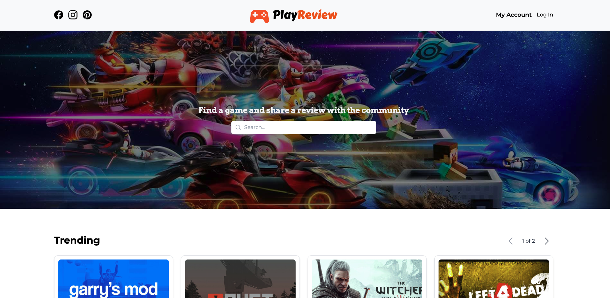
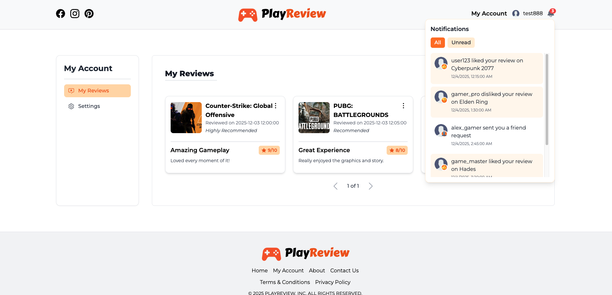
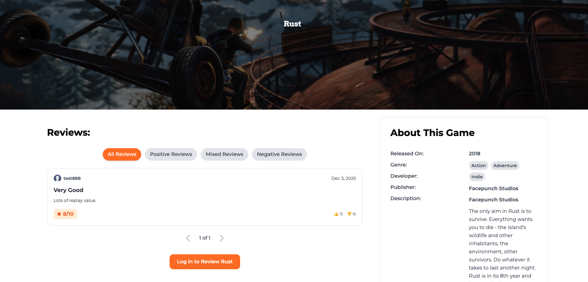
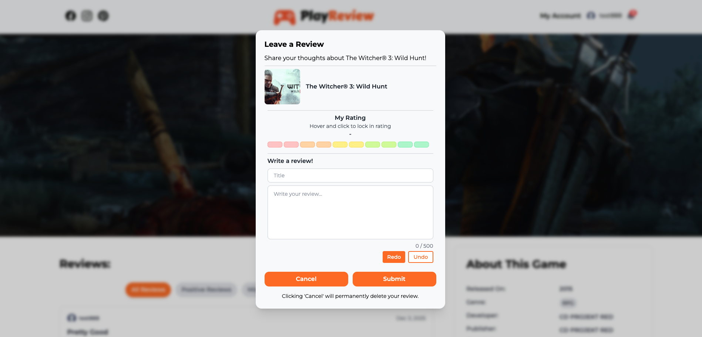
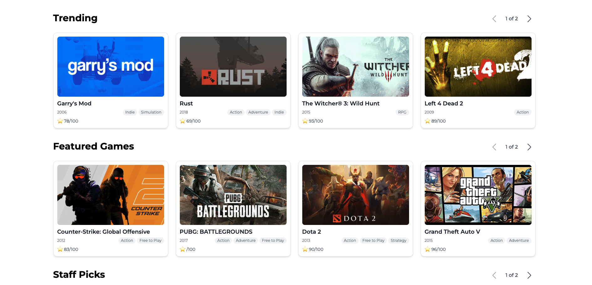

# 🎮 Play Review Microservice Platform

**Full-stack, Dockerized microservice platform for reviewing and liking games.**

---

## 🔹 Project Overview

This platform allows users to:

- Create accounts and log in (User Service)  
- Browse a catalog of games (Game Catalog Service)  
- Post reviews for games (Review Service)  
- Like other users' reviews (Likes Service)  
- Receive notifications when reviews are liked or replied to (Notification Service)  

**Tech Stack:**  
Node.js, Express, React, TailwindCSS, Docker, RabbitMQ, SQLite, Python, Flask

---

## 🌐 Live Demo

- Hosted Frontend (Mock/Data Only): [Vercel Link](https://play-review.vercel.app/)
- Note: Backend is not hosted. Full system requires local Docker setup.

---

## 📂 Microservice Repositories & Ports

| Service                  | Port  | Repo Link                                              | Description                                              |
|---------------------------|-------|--------------------------------------------------------|----------------------------------------------------------|
| User Service              | 3001  | [User Service Repo](https://github.com/kkennethsieu/user-service) | Handles login, signup, and authentication using JWT Tokens               |
| Game Catalog Service      | 3002  | [Game Catalog Service Repo](https://github.com/kkennethsieu/catalog-service) | Provides the catalog of games                            |
| Review Service            | 3003  | [Review Service Repo](https://github.com/kkennethsieu/reviews-service) | Stores and retrieves game reviews                        |
| Likes Service             | 3004  | [Likes Service Repo](https://github.com/kkennethsieu/likes-service) | Tracks likes on reviews                                   |
| Notification Service      | 3005  | [Notification Service Repo](https://github.com/kkennethsieu/notification-service) | Sends notifications for review interactions             |
| API Gateway               | 8000  | [API Gateway Repo](https://github.com/kkennethsieu/gateway-service)   | Routes requests to the appropriate services             |
| Frontend                  | 5173  | [Frontend Repo](https://github.com/kkennethsieu/game-frontend) | React frontend (mock/demo mode for hosted version)      |

---

## 💻 Run Full System Locally

### 1. Clone all repositories into the same folder

Your folder structure should look like this:

```
GameReview/
  docker-compose.yml
  user-service/
  game-service/
  review-service/
  likes-service/
  notification-service/
  api-gateway/
  frontend/
```

Clone the repositories:

```
git clone https://github.com/kkennethsieu/user-service
git clone https://github.com/kkennethsieu/catalog-service
git clone https://github.com/kkennethsieu/reviews-service
git clone https://github.com/kkennethsieu/likes-service
git clone https://github.com/kkennethsieu/notification-service
git clone https://github.com/kkennethsieu/gateway-service
git clone https://github.com/kkennethsieu/game-frontend
```

---

### 2. Start all services with Docker Compose

```
docker compose up --build
```

- Frontend runs on `http://localhost:5173`  
- Other services run on their respective ports listed in the table above  

---

## 📌 Notes

- Hosted frontend uses **mock/demo data** for login, reviews, likes, and notifications  
- Full system requires **local Docker setup** to see real backend functionality  
- Designed to demonstrate **microservice architecture, Docker orchestration, and full-stack development skills**  

---

## 🎥 Screenshots

| Home Page | My Account |
|-----------|------------|
|  |  |

| About Game | Add Review | Trending Games |
|------------|------------|----------------|
|  |  |  |

